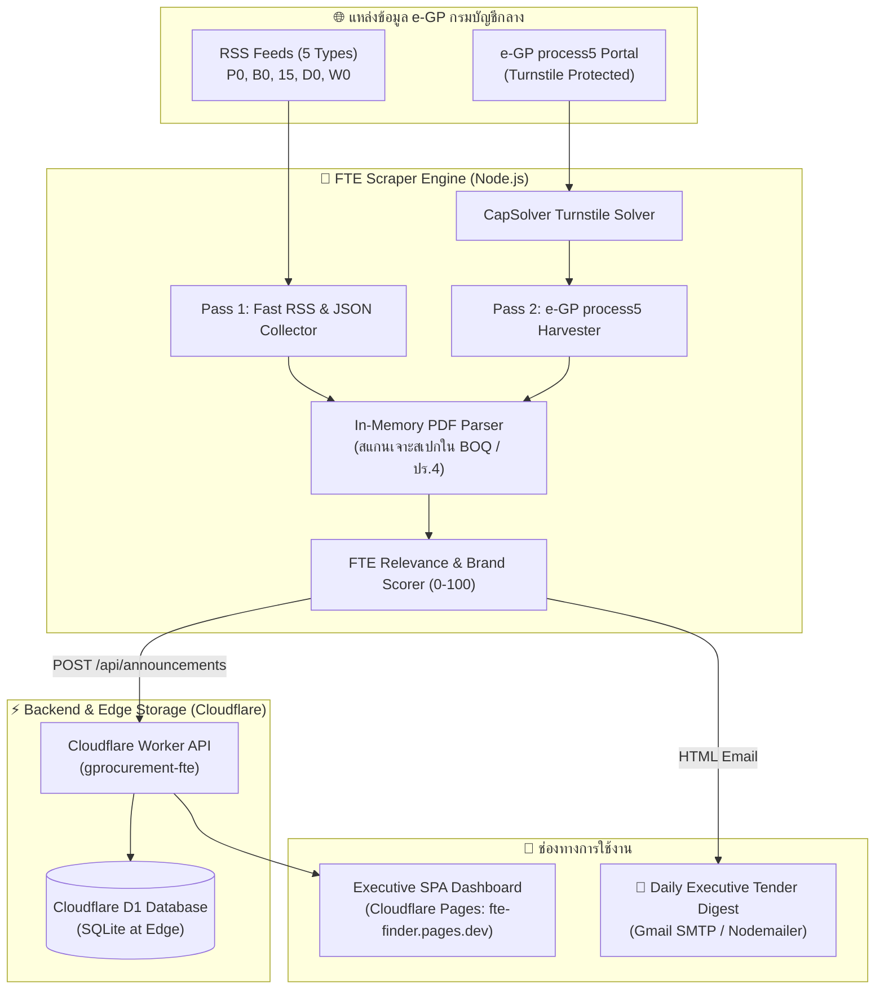

# 🔥 FTE B2G Command Center — Firetrade Engineering PCL
### ระบบสแกนโอกาสงานจัดซื้อจัดจ้างภาครัฐ (e-GP) อัจฉริยะ สำหรับ บริษัท ไฟร์เทรดเอ็นจิเนียริ่ง จำกัด (มหาชน)

[](https://firetrade.co.th/)
[](https://workers.cloudflare.com/)
[](https://developers.cloudflare.com/d1/)
[](https://nodejs.org/)

---

## 📌 ภาพรวมโครงการ (Project Overview)

**FTE B2G Command Center** เป็นระบบเฝ้าตรวจจับและวิเคราะห์โครงการจัดซื้อจัดจ้างภาครัฐ (ระบบ e-GP กรมบัญชีกลาง) แบบอัตโนมัติ ออกแบบและพัฒนาขึ้นเป็นพิเศษสำหรับ **บริษัท ไฟร์เทรดเอ็นจิเนียริ่ง จำกัด (มหาชน) (SET: FTE)** ผู้นำเข้าและจัดจำหน่ายระบบดับเพลิงอัตโนมัติ อุปกรณ์เตือนภัย และความปลอดภัยครบวงจรอันดับหนึ่งของประเทศไทย

ระบบช่วยให้ทีมขายวิศวกรรม (Engineering Sales) และฝ่ายประมูลงานราชการ สามารถ:
1. **สแกนพบโครงการก่อนคู่แข่ง**: ดึงประกาศตั้งแต่ขั้น **แผนจัดซื้อจัดจ้าง (P0)** และ **ร่าง TOR (B0)**
2. **สแกนเจาะลึกเนื้อในเอกสารแนบ PDF (In-Memory Scanner)**: ตรวจจับสเปกแบรนด์ในเครือ เช่น Notifier, Morley, System Sensor, Patterson, Viking, NIBCO, Max Bright และมาตรฐาน NFPA / UL-FM
3. **วิเคราะห์คู่แข่งและราคาเคาะ (Smart Bidding Simulator)**: คำนวณจุดคุ้มทุน (Floor Price), ต้นทุนอุปกรณ์และค่าแรงติดตั้ง, Factor F, ภาษีมูลค่าเพิ่ม (VAT 7%) และแนะนำกลยุทธ์เคาะราคาชนะงาน
4. **สรุปรายงานผู้บริหารส่งอีเมลอัตโนมัติ (Daily Executive Tender Digest)**: ส่งอีเมลสรุปทุกเช้าเวลา 07:00 น.

---

## 🏷️ 5 หมวดหมู่ผลิตภัณฑ์หลักของ FTE (Product Scope)

| หมวดหมู่ | รหัสกลุ่ม | ตัวอย่างอุปกรณ์ & แบรนด์ที่ระบบเฝ้าตรวจจับ |
|:---|:---:|:---|
| 🚨 **ระบบแจ้งเหตุเพลิงไหม้และอุปกรณ์ตรวจจับ** | `fire_alarm` | Fire Alarm Control Panel (FACP), Notifier, Morley-IAS, System Sensor, Smoke Detector, Heat Detector, Manual Station, Beam Detector, Strobe Light |
| 💦 **หัวกระจายน้ำดับเพลิง & เครื่องสูบน้ำดับเพลิง** | `fire_sprinkler_pump` | Fire Pump (เครื่องสูบน้ำดับเพลิงตามมาตรฐาน NFPA 20), Patterson Pump, Fire Sprinkler, Viking, Deluge Valve, Alarm Check Valve, Pre-Action Valve |
| 🧯 **ระบบสารสะอาด ดับเพลิงแก๊ส โฟม & ถังดับเพลิง** | `fire_suppression_gas` | ระบบสารสะอาดดับเพลิง Novec 1230, FM-200, HFC-227ea, CO2 Fire Suppression System, Foam System AFFF, ถังดับเพลิงเคมีแห้ง/ก๊าซ Badger, Total Fire |
| 🚒 **ตู้สายส่งน้ำ หัวรับน้ำ วาล์ว & อุปกรณ์ท่อ** | `fire_hydrant_equipment` | ตู้ดับเพลิง FHC (Fire Hose Cabinet), หัวรับน้ำดับเพลิง (Siamese Connection), หัวดับเพลิงฝังดิน (Fire Hydrant), วาล์วอุตสาหกรรม NIBCO, Grooved Couplings |
| 💡 **ไฟฉุกเฉิน ป้ายทางออก & ความปลอดภัยกู้ภัย** | `safety_ppe_emergency` | โคมไฟฉุกเฉิน (Emergency Light Max Bright), ป้ายไฟทางออกหนีไฟ (Exit Sign), สายไฟทนไฟ (FRC Cable), ชุดกู้ภัยดับเพลิง SCBA, ตู้เก็บสารไวไฟ |

---

## 🏗️ สถาปัตยกรรมระบบ (System Architecture)



---

## 📂 โครงสร้างโฟลเดอร์ (Directory Structure)

```
GProcurement-FTE/
├── .github/
│   └── workflows/
│       └── daily-scraper.yml        # GitHub Actions รันอัตโนมัติทุกเช้า 07:00 น.
├── frontend/                        # เว็บแอปพลิเคชัน Single Page Application (SPA)
│   ├── css/
│   │   ├── style.css                # ตัวแปรสี Flame Red, Base Styles & Badges
│   │   └── v2.css                   # สไตล์ Dark Executive B2G Command Center
│   ├── js/
│   │   ├── api.js                   # API Client เชื่อมต่อ Cloudflare Worker
│   │   ├── auth.js                  # ระบบยืนยันตัวตน (Authentication & Roles)
│   │   ├── common.js                # ฟังก์ชันฟอร์แมตเงิน วันที่ และ FTE Group Labels
│   │   ├── simulator.js             # Smart Bidding Simulator & 3 กลยุทธ์ราคา
│   │   ├── winners.js               # Competitor Intelligence & สถิติคู่แข่ง
│   │   └── v2.js                    # Controller หลักของ Command Center V2
│   ├── dashboard.html               # หน้าแดชบอร์ดหลัก (Executive Command Center)
│   ├── v2.html                      # สำเนาแดชบอร์ด
│   ├── detail.html                  # หน้ารายละเอียดโครงการและไฟล์แนบ
│   ├── admin.html                   # หน้าจัดการผู้ใช้งานและสถิติระบบสำหรับ Admin
│   ├── login.html                   # หน้าเข้าสู่ระบบ
│   ├── register.html                # หน้าสมัครสมาชิก
│   ├── pending.html                 # หน้ารอการอนุมัติสิทธิ์จาก Admin
│   └── privacy.html                 # หน้านโยบายคุ้มครองข้อมูลส่วนบุคคล (PDPA)
├── scraper/                         # ระบบดึงข้อมูลและสแกนเอกสารจัดซื้อจัดจ้าง
│   ├── src/
│   │   ├── email/                   # เทมเพลตอีเมลสรุปโครงการประจำวัน (FTE Theme)
│   │   ├── harvest-egp5.js          # สแกนเนอร์ e-GP process5 ผ่าน CapSolver
│   │   ├── in-memory-pdf-parser.js  # มุดอ่านไฟล์ BOQ/TOR ค้นหาสเปก Notifier, Viking, etc.
│   │   ├── keywords.js              # คลังคำค้นหาและ Exclusion Terms ของ FTE
│   │   ├── index.js                 # Entry point ของระบบ Scraper
│   │   └── d1-client.js             # Client ซิงค์ข้อมูลเข้า Cloudflare D1
│   └── package.json
├── worker/                          # Cloudflare Worker REST API
│   ├── migrations/
│   │   └── 0001_init.sql            # สคีมาตาราง Cloudflare D1 (Indexed & Normalized)
│   ├── src/
│   │   ├── routes/                  # REST API Endpoints (announcements, users, winners)
│   │   └── index.js                 # Entry point ของ Worker พร้อม Dynamic CORS
│   └── wrangler.toml                # การตั้งค่า Cloudflare Worker (gprocurement-fte)
├── .env.example                     # ไฟล์ตัวอย่างตัวแปรสภาพแวดล้อม
├── .env                             # ไฟล์เก็บความลับส่วนตัว (Local Only - Ignored by Git)
└── README.md
```

---

## ⚙️ ขั้นตอนการติดตั้งและตั้งค่าระบบ (Setup Instructions)

### 1. การเตรียมตัวแปรสภาพแวดล้อม (Local `.env`)
เปิดไฟล์ `.env` ในโฟลเดอร์โปรเจกต์ด้วยตนเอง และกรอกค่าที่ต้องการ:
```env
# ข้อมูลผู้ดูแลระบบ (Admin)
ADMIN_EMAIL=contact@firetrade.co.th
ADMIN_PASSWORD=your_secure_password
RECOVERY_KEY=FTE-2026-RECOVERY-MASTER

# Gmail SMTP สำหรับส่งสรุปงานประมูลรายวัน
GMAIL_USER=your_email@gmail.com
GMAIL_APP_PASSWORD=your_16_character_app_password
GMAIL_RECIPIENTS=sales@firetrade.co.th,tender@firetrade.co.th

# CapSolver สำหรับแก้ Cloudflare Turnstile ใน e-GP
CAPSOLVER_API_KEY=your_capsolver_key

# Cloudflare D1 Backend Worker API
D1_API_URL=https://gprocurement-fte.<your-subdomain>.workers.dev
D1_API_KEY=your_worker_secret_key
```

### 2. การสร้างและ Deploy Cloudflare D1 & Worker
```powershell
cd worker
npm install

# 1. ล็อกอินเข้าสู่ Cloudflare CLI
npx wrangler login

# 2. สร้างฐานข้อมูล D1
npx wrangler d1 create gprocurement-fte-db
# นำ database_id ที่ได้ไปวางใน worker/wrangler.toml

# 3. รัน Migration เพื่อสร้างตารางทั้งหมด
npx wrangler d1 execute gprocurement-fte-db --remote --file=./migrations/0001_init.sql

# 4. Deploy Worker ขึ้นสู่ Cloudflare Edge
npx wrangler deploy
```

### 3. การทดสอบ Scraper ในเครื่องคอมพิวเตอร์
```powershell
cd scraper
npm install

# ทดสอบรันการดึงข้อมูล 1 รอบ
node src/index.js
```

### 4. การตั้งค่า GitHub Actions (Daily Automated Run)
นำตัวแปรใน `.env` ไปตั้งค่าใน GitHub Repository ของคุณ:
- เข้าไปที่ **Settings** -> **Secrets and variables** -> **Actions** -> **New repository secret**
- ใส่ค่าดังต่อไปนี้:
  - `GMAIL_USER`
  - `GMAIL_APP_PASSWORD`
  - `GMAIL_RECIPIENTS`
  - `CAPSOLVER_API_KEY`
  - `D1_API_URL`
  - `D1_API_KEY`
  - `ADMIN_EMAIL`

---

## 🧮 เครื่องคิดเลขเคาะราคา (Smart Bidding Simulator)

ระบบมีเครื่องมือ Bidding Simulator สำหรับทีมขายวิศวกรรมของ FTE โดยคำนวณตามหลักสูตรจัดซื้อจัดจ้างภาครัฐไทย:
$$\text{ราคาเคาะประมูล (รวม VAT)} \longrightarrow \text{รายรับสุทธิ (ก่อน VAT)} = \frac{\text{ราคาเคาะ}}{1.07}$$
$$\text{ต้นทุนรวม} = \text{ต้นทุนอุปกรณ์หลัก FTE} + \text{ค่าแรงติดตั้งและระบบ} + \text{ค่างานอื่นๆ (Factor F)} + \text{เงินสำรอง}$$
$$\text{กำไรแท้จริง (True Profit)} = \text{รายรับสุทธิ} - \text{ต้นทุนรวม}$$

พร้อมฟังก์ชันเปรียบเทียบสถิติการตัดราคาของตลาด e-GP เพื่อให้เสนอราคาในระดับที่ชนะงานและเหลือกำไรสูงสุด

---

## 🛡️ มาตรการความปลอดภัยและความเป็นส่วนตัว (Security Compliance)

- **Universal Credentials Safety**: ไม่มีการฮาร์ดโค้ดรหัสผ่าน หรือส่งรหัสผ่านในช่องทางที่ไม่ปลอดภัย ข้อมูลลับทั้งหมดจัดเก็บใน `.env` และ GitHub Secrets เท่านั้น
- **PDPA Compliant**: รองรับมาตรการรักษาความปลอดภัยของข้อมูลส่วนบุคคลและข้อมูลจัดซื้อจัดจ้าง
- **Robust Failover**: ระบบมุดอ่านเอกสารในหน่วยความจำ (RAM) โดยไม่เก็บไฟล์ PDF ลงบนดิสก์ ช่วยลดพื้นที่และป้องกันข้อมูลรั่วไหล

---

**พัฒนาสำหรับ**: บริษัท ไฟร์เทรดเอ็นจิเนียริ่ง จำกัด (มหาชน) — Firetrade Engineering PCL  
**เว็บไซต์ทางการ**: [https://firetrade.co.th/](https://firetrade.co.th/)
